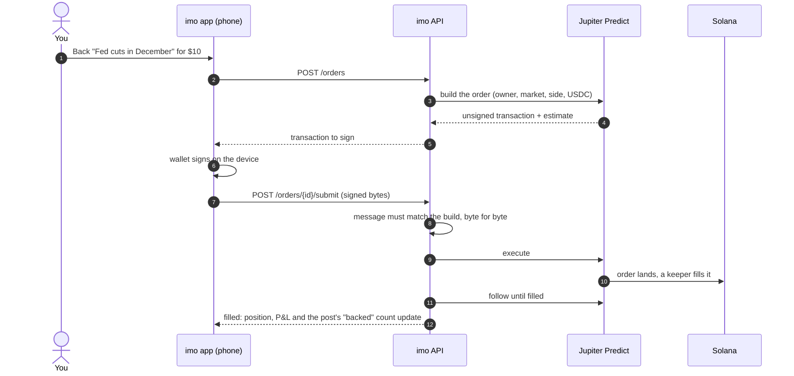
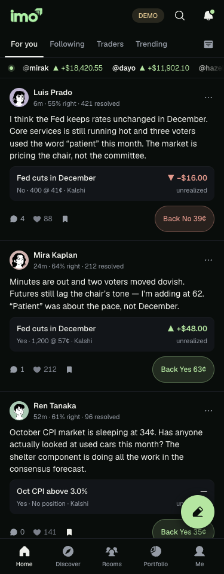
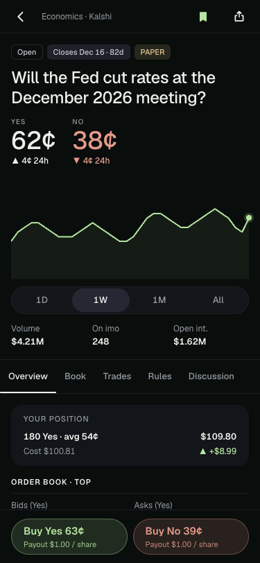
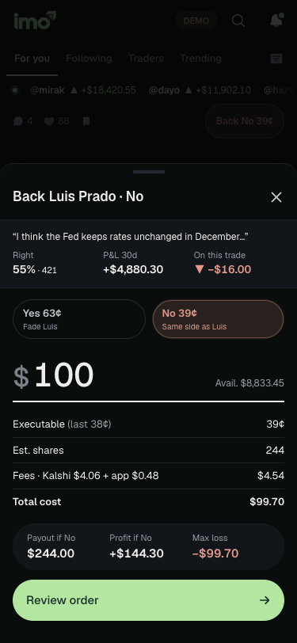
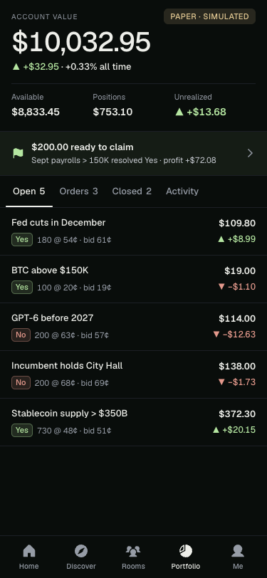
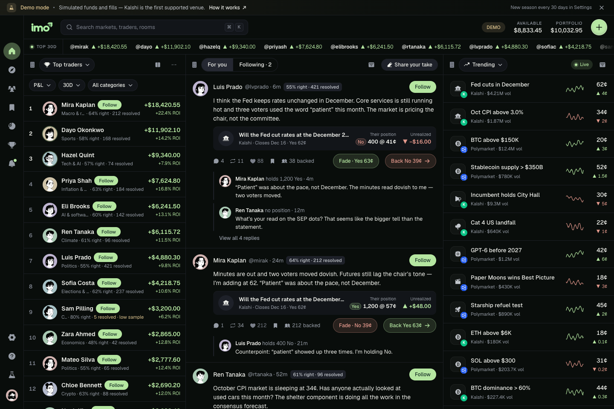
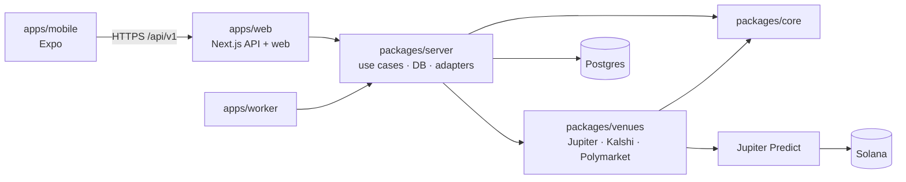

<p align="center">
  
</p>

<p align="center">
  <b>Make a call. Back it with real money. Let your record speak.</b><br/>
  imo turns prediction markets into a social network: people post their calls on real markets,
  others <i>Back</i> or <i>Fade</i> them with a trade, and every profile carries a track record
  that can't be faked, because it's settled on Solana.
</p>

<p align="center">
  
  
  
  
  
  
  <a href="https://github.com/dotsvm/imo-app/actions/workflows/ci.yml"></a>
</p>

---

## Why imo

Prediction markets are the best real-time signal on what's going to happen, but they're lonely.
You see a price, not the people and the reasoning behind it, and anyone can claim they "called it"
after the fact.

imo fixes both:

- **Calls with skin in the game.** A post is a position on a real market, stamped with the price
  when it was made. When the market resolves, the call is marked right or wrong, publicly.
- **Back or Fade, in one tap.** Agree with a call? Back it. Think they're wrong? Fade it. Either way
  it's a real trade on the same market, from your own wallet.
- **Records that can't be faked.** P&L, hit rate and the leaderboard come from real fills and
  onchain settlement, not screenshots.
- **Rooms for people who trade the same things.** Team-chat rooms per topic, with the room's
  markets pinned on top and members' positions shown on their messages.

## How it works on Solana

imo trades on **[Jupiter Predict](https://jup.ag/prediction)**: Solana prediction markets that route
to Kalshi and Polymarket books and settle in USDC. Every trade is a transaction the trader signs on
their own device; imo never holds keys or funds.



- **Non-custodial.** Each person gets an embedded Solana wallet (Privy) unlocked by their imo
  session. The key never reaches our servers.
- **Exactly what you saw.** The API only relays the transaction it built for you. A signed payload
  whose message differs is refused, so it can't be used to relay anything else.
- **Mirrored, not trusted.** Fills, positions, payouts and P&L are mirrored into Postgres (each venue
  fill exactly once) so feeds, profiles and the leaderboard stay fast and always come from real fills.
- **Deposit and withdraw USDC** to and from any Solana address, from inside the app.

## Screens

The mobile app (Expo) is the product, built for the **Solana Seeker** first, then iOS and Android.
The web app shares the same API and brings the same experience to desktop.

<table>
  <tr>
    <td align="center"><br/><sub>Calls from people you follow</sub></td>
    <td align="center"><br/><sub>A market: chart, book, discussion</sub></td>
    <td align="center"><br/><sub>Back or Fade a call</sub></td>
    <td align="center"><br/><sub>Portfolio and positions</sub></td>
  </tr>
</table>

<p align="center">
  
  <br/><sub>The web app: top traders, the feed and trending markets side by side. Screenshots use the demo dataset.</sub>
</p>

## What's inside

A TypeScript monorepo (npm workspaces + Turborepo):

```
imo/
├── apps/
│   ├── mobile/      Expo (React Native) app: Seeker first, then iOS and Android
│   ├── web/         Next.js 16: the web app and the /api/v1 API every client shares
│   ├── worker/      Long-running jobs: venue feeds, order tracking, settlement, notifications
│   └── waitlist/    The claim-your-username site used before launch
├── packages/
│   ├── core/        Money, fees, quotes, market lifecycle. Pure and framework-free
│   ├── venues/      Venue SDK + adapters: Jupiter Predict, Kalshi, Polymarket
│   ├── domain/      Shared product types and the demo dataset
│   └── server/      Use cases, Postgres schema + migrations, ports and adapters
└── docs/            Architecture, deployment, verification, brand
```



**Pluggable by design.** Venues, data sources, wallets and infrastructure sit behind ports
(`packages/venues/src/sdk`, `packages/server/src/composition`). Adding a venue is a module and a line
of configuration, with no changes to the core or the apps. Package boundaries are enforced by ESLint:
the core imports nothing, and venue modules import only the core and the SDK.
See [docs/architecture/extensibility.md](docs/architecture/extensibility.md).

## Tech

| Area | Stack |
| --- | --- |
| Mobile | Expo SDK 57 · React Native 0.86 (New Architecture) · Expo Router · Reanimated 4 · TanStack Query |
| Web + API | Next.js 16 (App Router, Turbopack) · React 19 · Tailwind 4 |
| Solana | Jupiter Predict API · `@solana/kit` · Privy embedded wallets |
| Data | Postgres (Supabase) · Drizzle ORM · transactional outbox · leased worker lanes |
| Auth | Supabase (email code, Google, Apple) · Privy custom auth on Supabase's JWKS |
| Quality | Strict TypeScript · ESLint boundaries · node:test + fast-check · Playwright · GitHub Actions |

## Quick start

**Requirements:** Node 22+ (24 recommended) and Postgres 14+.

```bash
git clone https://github.com/dotsvm/imo-app.git imo && cd imo
npm install
cp .env.example .env.local          # the demo profile needs only DATABASE_URL

createdb imo_dev
DIRECT_URL=postgres://localhost:5432/imo_dev npm run db:migrate

npm run dev                          # web + API on http://localhost:3000
npm run worker                       # feeds, order tracking, settlement (second terminal)
```

The **demo profile** (the default) runs on a built-in dataset with dev sign-in, so no keys are
needed. For real markets and real trading, set `APP_PROFILE=production` plus Supabase, Privy and
`JUPITER_API_KEY` (see `.env.example` and [docs/deploy.md](docs/deploy.md)).

**Mobile app:**

```bash
cd apps/mobile && npm install
cp .env.example .env.local          # EXPO_PUBLIC_API_URL=http://<your LAN IP>:3000
npx expo start                      # Expo Go to browse; a development build to trade
```

Trading signs with native wallet modules, so it needs a development build
(`eas build --profile development --platform android`) rather than Expo Go.
More in [apps/mobile/README.md](apps/mobile/README.md).

## Scripts

| Command | What it does |
| --- | --- |
| `npm run dev` | Web app + API |
| `npm run worker` | Background worker |
| `npm run verify` | Typecheck, lint and unit tests across every package (Turborepo) |
| `npm run test:db` | API integration tests against Postgres (`DATABASE_URL=…/hunch_test`) |
| `npm run test:e2e` | Browser end-to-end tests (Playwright) |
| `npm run db:generate` · `npm run db:migrate` | Create · apply database migrations |
| `npm run mobile` | Start the Expo app |

## Quality

- **150+ unit tests:** money math (property-based, with fast-check), quotes, fees, venue adapters
  against recorded payloads, and Jupiter execution (order builds, signer checks, fills, claims).
- **110+ API integration tests** against a real Postgres: trading, settlement, rooms, social,
  permissions, and the whole wallet flow (build, sign, submit, fill, sell, claim, withdraw).
- **End-to-end browser tests** with accessibility checks (axe).
- CI runs types, lint, unit and database tests, the mobile app's checks, and a dependency audit
  on every push.

## Security

- No keys or funds on our servers: every trade, sale, claim and withdrawal is signed on the user's device.
- Server-built transactions only: a submitted transaction must match what was built for that user.
- Venue API keys stay on the server; the app never ships them.
- Uploads are checked on the server (type, size, ownership) before anything points at them.
- Secrets live in environment variables only; `.env*` files are never committed.

## Status

Working today: the social layer (feed, posts, Back/Fade, rooms, watchlists, leaderboard,
notifications), Jupiter Predict market data, and real-money trading from the embedded wallet
(buy, sell, claim, deposit, withdraw). Next: Seed Vault signing on the Seeker, push notifications,
and the Solana dApp Store release.

---

<p align="center"><sub>© 2026 imo. All rights reserved.</sub></p>
