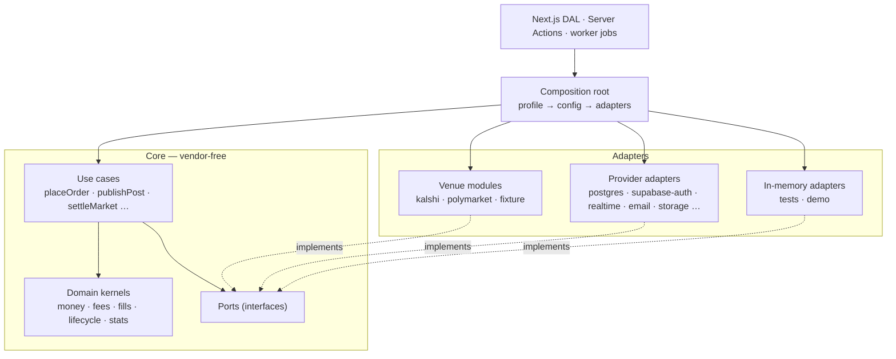

# Extensibility: venues and providers

How imo stays open to new venues, data providers and wallets without touching its core. Draft v1 · September 29, 2026.

**The goal:** adding a venue, a data source, an execution route or an infrastructure provider
means adding **one module and one configuration row**. It should need no changes to the core,
the UI or any other adapter. This document is the contract that keeps that true. Its rules are
enforced in CI, not left to good intentions.

---

## 1. Shape: ports and adapters



### The rules

CI enforces each rule with `eslint-plugin-boundaries`, dependency-cruiser or plain lint rules.

1. **The core imports nothing vendor-specific.** `packages/core/src/**` imports no SDK, no
   `packages/venues/src/**` and no `packages/server/src/adapters/**`.
2. **Only the composition root imports adapters.** Features, the DAL and jobs receive ports.
3. **No venue or vendor names in the core or the UI.** A lint rule rejects
   `/kalshi|polymarket|supabase|resend|…/i` in `src/core`, `src/features`, `src/components` and
   `src/data`. Tests and fixtures are exempt.
4. **Branch on capabilities, never on identity.** Write `if (caps.orderTypes.includes("limit"))`,
   never `if (venue === "kalshi")`.
5. **Parse at the edge.** Every external payload goes through a zod schema inside its adapter.
   Raw vendor types never leave it.
6. **One HTTP and WebSocket stack.** Adapters get it from the shared context (§4.5), which
   applies timeouts, retries, circuit breakers, tracing and the egress allowlist. Adapters never
   call `fetch` directly.
7. **Every adapter passes its conformance kit** (§8) before it can be enabled.
8. **Browsers never talk to venues or vendors directly.** The one exception is the thin client
   ports (§6.3). This protects data rights, rate limits and secrets, and it makes swaps
   invisible to the UI.

---

## 2. Three venue concepts, kept separate

| Concept             | What it is                                                                    | Examples                                                                                                    |
| ------------------- | ----------------------------------------------------------------------------- | ----------------------------------------------------------------------------------------------------------- |
| **Venue**           | Where a market lives and settles. It owns the rules, the result and the fees  | Kalshi, Polymarket                                                                                          |
| **Data source**     | Where we _read_ market data for one or more venues. Venues can have fallbacks | `kalshi-direct`, `polymarket-public`, a licensed aggregator                                                 |
| **Execution route** | How an order reaches a venue — or doesn't                                     | `paper` (ours), `polymarket-builder`, `kalshi-partner` (Builders or FCM), `dflow-solana` (tokenized Kalshi) |

**Why keep them apart:**

- Kalshi data could come from a licensed aggregator while orders go through a partner.
- Tokenized Kalshi markets on Solana are the _same venue_ through a _different route_.
- Paper trading is a route, not a special case. Paper and live orders share one model, one state
  machine and one UI.

---

## 3. The canonical model (all the core ever sees)

### 3.1 Identity and references

- Every entity has an internal UUID.
- External identity lives in `external_refs(entity_type, entity_id, source_id, external_id,
external_version)`. A market can then be re-mapped or served by a fallback source without
  changing its ID.
- `VenueId`, `DataSourceId` and `RouteId` are branded strings from the registry, not unions in
  code.

### 3.2 Markets and outcomes

Outcomes are rows, not Yes/No columns:

```ts
type MarketType = "binary" | "categorical" | "scalar";

interface Market {
  id: MarketId;
  venueId: VenueId;
  eventId?: EventId; // groups related markets
  type: MarketType; // beta enables "binary" only
  outcomes: Outcome[]; // binary = [Yes, No]
  title: string;
  rules: string;
  resolutionSource: string;
  status: MarketStatus; // canonical, §3.4
  tick: Price; // smallest price step, per market
  quantityStep: Quantity; // e.g. 1 share, or 0.01 on fractional venues
  fees: FeeModelRef; // §3.5
  opensAt?: Date;
  closesAt: Date;
  expectedResolutionAt?: Date;
}
interface Outcome {
  id: OutcomeId;
  label: string;
  index: number;
}
```

`isBinary(market)` and `yesNo(market)` helpers keep today's Yes/No UI exactly as designed.
Categorical and scalar markets are a capability to switch on later; they need no schema change.

### 3.3 Money, prices and quantities

```ts
interface Currency {
  code: CurrencyCode; // "USD" | "USDC" | "PUSD" | …, from a registry
  scale: number; // minor-unit decimals: USD 6 (micros), USDC 6, SOL 9
}
interface Money {
  // Integer minor units of `currency`, held in a JS number: exact to 2^53,
  // about $9B in micro-dollars. Postgres stores bigint. Finer tokens (18
  // decimals) convert to the registered scale at the adapter edge.
  amount: number;
  currency: CurrencyCode;
}
type Price = Money; // per 1 share of an outcome, in the market's collateral
type Quantity = { units: bigint; scale: number }; // shares × 10^scale
```

- Arithmetic lives in one module with explicit rounding modes (up, down, half-even) and
  property tests.
- Paper accounts hold USD. A live route holds the venue's collateral.
- Converting between currencies is explicit and never implicit.

### 3.4 Lifecycle: one state machine

```text
upcoming → open ⇄ paused → closed → determined ⇄ disputed → resolved
                                   ↘ voided          (any non-final → delisted)
```

- Each source ships a mapping table (venue state → canonical state), and illegal transitions are
  rejected.
- An unmapped venue state becomes `unknown`. It raises an alert and blocks trading on that
  market.
- **Settlement runs only on `resolved`,** the final state. Examples: Kalshi's `settled`
  (`finalized` in REST), and Polymarket's final resolution after the UMA challenge window.

### 3.5 Fees as data

```ts
// packages/core/src/fees.ts
interface FeeRounding {
  mode: RoundingMode; // "ceil" | "floor" | "trunc" | "half-up" | "half-even"
  decimals: number; // of the currency unit: 6 = $0.000001, 2 = a cent
}
type FeeModel =
  | { kind: "none" }
  | { kind: "quadratic"; rate: string; appliesTo: "taker" | "both"; rounding: FeeRounding } // C × rate × p × (1 − p)
  | { kind: "bps"; bps: number; appliesTo: "taker" | "both"; rounding: FeeRounding }
  | { kind: "composite"; parts: FeeModel[] };

interface FeeLine {
  source: "venue" | "app" | "route" | "network" | "rounding";
  label: string; // "Kalshi trading fee", "Hunch · 0.5%"
  amount: number; // minor units
}

// Pure, and shared by client previews and the server engine.
computeFees(schedule: FeeSchedule[], fill: FeeFill): FeeLine[];
```

Rounding is stated in decimals of the currency unit, not in minor units, so one model means the
same thing whether it is evaluated in cents (the demo) or micro-dollars (the server). Tiered fees
become a new `kind` the day a venue needs one.

- **Fee models are versioned with `effective_from`.** Kalshi publishes series and event fee
  changes; Polymarket sets rates by category.
- **The app fee is just another model:** `{ kind: "bps", bps: 50 }`, set per route.
- **Quotes carry `fees: FeeLine[]`.** The ticket renders whatever lines exist. A new venue that
  charges gas or a route fee needs no UI change.

### 3.6 Venue presentation is data

The registry returns:

- `name` and a short `mark`;
- a `logo` asset and a brand `color`, chosen from palette-safe tokens;
- copy snippets such as `settlementCopy` ("Settled by Kalshi" or "Resolved by UMA oracle").

`<VenueMark>`, fee labels and settings rows all read from it. Hard-coded "K" and "P" go away.

---

## 4. Venue SDK

### 4.1 Manifest and capabilities

```ts
interface VenueManifest {
  id: VenueId; // "kalshi"
  name: string;
  kind: "exchange" | "protocol";
  collateral: CurrencyCode;
  display: {
    mark: string;
    logo?: string;
    color: string;
    settlementCopy: string;
  };
  capabilities: VenueCapabilities;
  schedule?: { maintenance: string[] }; // e.g. RRULE for Kalshi's Thursday pause
  dataRights: {
    display: boolean;
    quoteTtlSeconds: number;
    storeCandles: boolean;
    storeTrades: boolean;
    attribution?: string;
  };
  regions?: { allow?: string[]; deny?: string[] };
}

interface VenueCapabilities {
  marketTypes: MarketType[];
  orderTypes: ("market" | "limit")[];
  timeInForce: ("ioc" | "fok" | "gtc" | "gtd")[];
  fractionalQuantity: boolean;
  tick: "fixed" | "per-market" | "dynamic"; // Polymarket ticks can change mid-life
  streaming: {
    quotes: boolean;
    book: "none" | "snapshot" | "delta";
    trades: boolean;
    lifecycle: boolean;
  };
  history: { candleIntervals: ("1m" | "1h" | "1d")[]; lookbackDays?: number };
  settlement: { kind: "exchange" | "oracle"; disputes: boolean };
  pauses: ("trading" | "exchange")[];
}
```

### 4.2 Data sources

```ts
interface DataSourceModule {
  id: DataSourceId; // "kalshi-direct"
  venues: VenueId[];
  create(ctx: AdapterContext): MarketDataSource;
}

interface MarketDataSource {
  status(): Promise<VenueStatus>; // trading active, resume time
  listMarkets(cursor?: string): Promise<Page<SourceMarket>>; // mapped to canonical inside
  getMarket(ref: ExternalRef): Promise<SourceMarket>;
  getBooks(refs: ExternalRef[]): Promise<Book[]>; // normalized bids and asks per outcome
  getTrades?(ref: ExternalRef, since?: Date): Promise<Trade[]>;
  getCandles?(ref: ExternalRef, range: CandleRange): Promise<Candle[]>;
  stream?(refs: ExternalRef[], sink: EventSink<MarketDataEvent>): Subscription;
}
```

Methods marked `?` follow the capabilities. The core checks the manifest, never
`typeof source.stream`.

### 4.3 Execution routes (paper now, live later)

```ts
interface ExecutionRouteModule {
  id: RouteId; // "paper", "polymarket-builder"
  venues: VenueId[];
  mode: "paper" | "live";
  accountModel: "none" | "api-key" | "oauth" | "wallet" | "broker";
  fees: FeeModel; // e.g. the Hunch app fee
  create(ctx: AdapterContext): ExecutionVenue;
}

interface ExecutionVenue {
  place(intent: OrderIntent, account: AccountRef): Promise<OrderAck>;
  cancel(order: OrderRef, account: AccountRef): Promise<void>;
  get(order: OrderRef, account: AccountRef): Promise<ExecutionOrder>;
  stream?(account: AccountRef, sink: EventSink<ExecutionEvent>): Subscription;
  positions?(account: AccountRef): Promise<VenuePosition[]>;
  balances?(account: AccountRef): Promise<Money[]>;
}

interface OrderIntent {
  clientOrderId: string; // idempotency key end to end
  marketId: MarketId;
  outcomeId: OutcomeId;
  side: "buy" | "sell";
  type: "market" | "limit";
  quantity?: Quantity;
  notional?: Money;
  limitPrice?: Price;
  timeInForce: "ioc" | "fok" | "gtc" | "gtd";
  maxSlippage?: Price;
}
```

- **Paper is a route.** The paper simulator (§5 of the plan) implements `ExecutionVenue` against
  live books, so the order pipeline, state machine, ledger and UI are identical for paper and
  live.
- **Order states are canonical:** `new → accepted → partially_filled → filled | cancelled |
rejected | expired`. Venue states map onto them.
- **Pre-trade checks are a chain of ports** (`RiskCheck[]`): capability, market status, venue
  pause, balance, limits, and later KYC and geography. A new jurisdiction adds a check without
  touching the pipeline.
- **An `OrderRouter` port picks the route** for (user, market): the user's linked accounts, then
  eligibility, then price and fees. In the beta, every order routes to `paper`. Best-price
  routing across venues comes later.

### 4.4 Account linking and credentials

```ts
interface AccountLinker {
  model: "api-key" | "oauth" | "wallet" | "broker";
  begin(user: UserRef): Promise<LinkChallenge>; // OAuth URL, nonce to sign, form fields
  complete(user: UserRef, proof: LinkProof): Promise<LinkedAccount>;
  revoke(account: LinkedAccount): Promise<void>;
}
```

- **Wallets:** Sign-In with Solana or Ethereum proofs, checked server-side.
- **Credentials:** API keys and OAuth tokens go through the `SecretVault` port. That's envelope
  encryption under a KMS key, scoped to user and route; plaintext is never stored or logged.
- **Linked accounts** appear in Settings → Connected accounts. The list comes from the registry,
  so a new route shows up with no UI work.

### 4.5 What every adapter gets for free (`AdapterContext`)

| Tool                                | Behavior                                                                                                                                                            |
| ----------------------------------- | ------------------------------------------------------------------------------------------------------------------------------------------------------------------- |
| `http`                              | Timeouts, retries with jittered backoff (idempotent calls only), a circuit breaker per source, OpenTelemetry spans, the egress host allowlist, response-size limits |
| `ws`                                | Heartbeats (Polymarket `PING` every 10 s), reconnect with backoff, automatic resubscribe, sequence-gap detection → resnapshot, bounded buffers (backpressure)       |
| `rateLimiter`                       | A token bucket sized from source config (Kalshi: 10 tokens per request against the tier budget), shared across replicas through Redis                               |
| `secrets`                           | `SecretVault` for venue keys and user credentials                                                                                                                   |
| `sink`                              | The canonical market-data bus (§4.6)                                                                                                                                |
| `log`, `metrics`, `clock`, `config` | Every signal tagged with `source` and `venue`                                                                                                                       |

### 4.6 The canonical market-data bus

Adapters publish canonical events, and everything downstream consumes only these:

```ts
type MarketDataEvent =
  | { type: "market.upserted"; market: SourceMarket }
  | { type: "market.status"; ref: ExternalRef; status: MarketStatus; at: Date }
  | { type: "book.snapshot"; ref: ExternalRef; book: Book; seq?: bigint }
  | { type: "book.delta"; ref: ExternalRef; changes: BookChange[]; seq: bigint }
  | {
      type: "quote";
      ref: ExternalRef;
      outcomeId: OutcomeId;
      bid?: Price;
      ask?: Price;
      last?: Price;
      at: Date;
    }
  | {
      type: "trade";
      ref: ExternalRef;
      outcomeId: OutcomeId;
      price: Price;
      quantity: Quantity;
      at: Date;
    }
  | {
      type: "fees.changed";
      ref: ExternalRef;
      model: FeeModel;
      effectiveFrom: Date;
    }
  | {
      type: "resolved";
      ref: ExternalRef;
      resolution: Resolution;
      final: boolean;
    }
  | {
      type: "venue.status";
      venueId: VenueId;
      tradingActive: boolean;
      resumeAt?: Date;
    };
```

**Consumers:**

- the quote cache;
- the paper matcher;
- price alerts;
- settlement;
- the realtime relay;
- stats.

None of them know which venue sent an event. That is why a new venue costs nothing downstream.

### 4.7 Inside a venue module (anti-corruption layout)

```text
packages/venues/src/<id>/
  manifest.ts          identity, capabilities, display, data rights, schedule
  client.ts            transport: auth and signing, pagination, rate budgets (uses ctx.http/ws)
  schemas/             zod schemas of raw payloads, versioned per venue API
  mappers/             raw → canonical, pure and unit-tested (status, books, fees, outcomes)
  source.ts            MarketDataSource
  stream.ts            WebSocket subscription → canonical events
  route.ts             ExecutionVenue (only when live trading exists)
  fixtures/            recorded responses and stream captures for replay
  conformance.test.ts  runs the shared kit (§8)
  README.md            venue facts, API versions, deprecation calendar, contacts
```

---

## 5. Capabilities drive behavior

| Capability                               | Core and UI behavior                                                                           |
| ---------------------------------------- | ---------------------------------------------------------------------------------------------- |
| `orderTypes` lacks `"limit"`             | The ticket hides Limit; `placeOrder` rejects limit intents                                     |
| `fractionalQuantity`                     | The quantity input accepts decimals down to `quantityStep`                                     |
| `tick: "per-market" \| "dynamic"`        | Price inputs step by the market's tick; displays show the decimals the tick needs (62¢, 0.25¢) |
| `settlement.kind: "oracle"` + `disputes` | "Result pending · challenge window" state; settlement waits for `resolved`                     |
| `streaming.book: "none"`                 | Books are polled; the freshness target relaxes; the badge reads "Updated 12s ago"              |
| No execution route for the venue         | The market is view-only; the ticket is replaced by "Trading not available here"                |
| `dataRights.display: false`              | The market is visible to admins only                                                           |
| `pauses` includes `"trading"`            | Paused markets allow cancels but not new orders, mirroring the venue                           |

---

## 6. Infrastructure providers

### 6.1 Ports

Each port has a beta adapter and an in-memory adapter.

| Port                                                             | Beta adapter                       | Swap candidates                      | Conformance checks                                                                  |
| ---------------------------------------------------------------- | ---------------------------------- | ------------------------------------ | ----------------------------------------------------------------------------------- |
| `Database` (`UnitOfWork` + repositories)                         | Drizzle on Postgres                | Any Postgres (Neon, RDS, Cloud SQL)  | Migrations apply cleanly; transactions roll back; `FOR UPDATE` locking              |
| `JobQueue`                                                       | pg-boss                            | SQS, Vercel Queues, BullMQ           | At-least-once delivery, retries with backoff, dedupe keys, delayed jobs             |
| `Outbox` / `EventBus`                                            | Postgres outbox + relay            | Kafka / Redpanda                     | Ordering per key; idempotent consumers                                              |
| `Realtime` (publisher, authorizer, client)                       | Supabase Realtime                  | Ably, Pusher, self-hosted            | Private-channel auth, presence, reconnect, message-size limits                      |
| `Cache`, `RateLimiter`                                           | Upstash Redis                      | Redis Cloud, in-memory               | TTLs; atomic consume                                                                |
| `Identity`                                                       | Supabase Auth                      | Better Auth, Clerk                   | Session lookup, sign-out, identity linking; internal user IDs via `auth_identities` |
| `Mailer`                                                         | Resend (our React Email templates) | Postmark, SES                        | Idempotent sends; bounce and complaint webhooks normalized                          |
| `ObjectStorage`                                                  | Supabase Storage                   | S3, R2, Vercel Blob                  | Signed uploads with type and size limits; deletes                                   |
| `SearchIndex`                                                    | Postgres FTS + trigram             | Typesense, Meilisearch               | Relevance parity on a fixed query set                                               |
| `FeatureFlags`                                                   | `flags` table                      | GrowthBook, LaunchDarkly             | Targeting by user, cohort and venue                                                 |
| `Analytics`                                                      | PostHog                            | Segment                              | One event schema                                                                    |
| `Telemetry`                                                      | OpenTelemetry → OTLP               | Sentry, Grafana, Datadog as backends | Trace propagation from web through the worker                                       |
| `SecretVault`                                                    | Cloud KMS envelope                 | Any KMS                              | Round-trip; context binding; key rotation                                           |
| `Moderation`                                                     | Rules + manual queue               | A moderation API                     | Scoring on labelled samples                                                         |
| Later: `Kyc`, `Wallet`, `Payments`, `GeoCompliance`, `Sanctions` | —                                  | Persona, Privy or Turnkey, Stripe, … | Defined when real trading starts                                                    |

**Identity mapping keeps us portable.** Users are ours (`users.id`). A provider's subject maps
through `auth_identities(provider, subject, user_id)`. Changing auth providers is then an adapter
plus an identity import, not a data migration.

### 6.2 Composition root

```text
packages/server/src/composition/
  config.ts     zod-validated env + DB config (fails fast at boot)
  profiles.ts   production | staging | test | demo → which adapter backs each port
  index.ts      createDeps(profile) → typed Deps; the only file that imports adapters
```

- No DI framework — plain factories and a typed `Deps` object.
- Tests call `createDeps("test")`: in-memory adapters plus the fixture venue.
- **Demo mode becomes a profile** (in-memory providers plus the fixture venue, seeded with
  today's data). The client-side mock can retire once each domain has moved.

### 6.3 Client-side ports

Only three vendor SDKs may run in the browser, each behind a tiny port picked at build time:

- `RealtimeClient` — `subscribe`, `presence`, token refresh;
- `AnalyticsClient` — `track`;
- `Uploader` — send to a signed URL.

---

## 7. Registry, modes and isolation

**Registry:**

- Code manifests are the defaults.
- `venues`, `data_sources` and `execution_routes` rows hold the operational state: `enabled`,
  `mode`, `priority`, rate budgets, retention and regions. Every change is audited.

**Modes per venue and per route:** `off → data-only → paper → live`. Every step is a flag flip
with its own checklist (§9). Capabilities can be switched off individually — for example "limit
orders on venue X".

**Failover:**

- Each venue has an ordered list of data sources.
- A health score (staleness, error rate, reconnects) decides which is active.
- The UI shows a fidelity badge when a fallback is serving.

**Bulkheads:**

- Each data source runs in its own worker **lane**, with its own queue, circuit breaker and rate
  budget. A failing venue can't starve the others.
- Lanes spread across worker replicas through Postgres advisory-lock leases. Scaling out means
  adding replicas.

**Graceful degradation:**

- When a source is down, serve the last quotes marked delayed.
- Refuse market orders past twice the freshness target.
- Keep social features fully up.

---

## 8. Conformance kits (why adding is safe)

`defineVenueConformance(module, fixtures)` runs the same suite against every source and route.
It checks:

- **catalog:** pagination completes; IDs are stable across pages; every market maps to a valid
  canonical market with a complete outcome set;
- **prices:** within the venue's range and on the tick grid;
- **books:** bids descending and asks ascending; a crossed book is either flagged or impossible;
  quantities are positive;
- **lifecycle:** every venue state is mapped; recorded transition sequences are legal in the
  canonical machine;
- **resolution:** only final results emit `resolved(final: true)`; voids map to `voided`;
- **fees:** never negative; symmetric where declared; they match recorded venue examples,
  including rounding;
- **streams:** duplicate and out-of-order messages are ignored; a sequence gap triggers a
  resnapshot; after a simulated disconnect, subscriptions are restored;
- **rate limits:** a synthetic burst never exceeds the declared budget;
- **routes:** `clientOrderId` idempotency, the canonical order-state transitions, and cancel
  after partial fill.

`defineProviderConformance(port, adapter)` does the same for infrastructure. It runs against both
the real adapter (in CI with service containers) and the in-memory one, so the two can't drift
apart.

**Drift detection:**

- Recorded fixtures replay on every PR.
- A nightly live smoke test runs against each enabled source.
- A zod parse failure in production alerts on-call, tagged with source and venue.

---

## 9. Playbooks

### Add a venue

1. `npm run venue:new <id>` scaffolds the module (§4.7) and its README. The generator ships with
   the venue SDK in Phase 1.
2. Write the manifest: capabilities, collateral, precision, fees, settlement, pauses, regions,
   and the **data rights you actually hold in writing**.
3. Build the transport client on `ctx.http` and `ctx.ws`: auth, pagination, rate budget.
4. Record fixtures and write the zod schemas.
5. Write the mappers (status, outcomes, books, fees, resolution) with unit tests.
6. Implement `MarketDataSource`, and `stream` if the venue can.
7. Pass the conformance kit. It's a CI gate.
8. Register the module. Add its `venues`, `data_sources` and `category_map` rows and brand
   assets.
9. Roll out: `data-only` (internal) → soak for a week (staleness, errors, parse failures) →
   `paper` behind a cohort flag → everyone.

**Untouched:** the engine, matcher, settlement, stats, realtime, notifications and UI.

### Add a data source for an existing venue

Follow steps 1–7 with `venues: [<id>]` and a lower `priority`. Run it in shadow mode, comparing
quotes with the primary source, then promote it to fallback.

### Add an execution route (the step to live trading)

1. Implement `ExecutionVenue` and `AccountLinker`, then pass the route conformance kit on the
   venue's sandbox. Kalshi has a demo environment.
2. Add the pre-trade checks the route needs (KYC, geography, limits) as `RiskCheck`s.
3. Complete the compliance checklist: agreements, KYC/AML, records retention, disclosures.
4. Roll out: internal accounts → a small cohort, with a per-route notional cap → broader.
   `live` mode stays behind a per-route kill switch.

### Swap an infrastructure provider

1. Implement the port adapter and pass the provider conformance kit.
2. **Dual-run:** shadow reads, or dual writes for email and realtime, and compare.
3. Flip `profiles.ts` config in staging, then production.
4. Migrate the data (object copy, identity import) with a verification job, then remove the old
   adapter.

---

## 10. Versioning and change management

- **Canonical types are versioned.** Bus events carry `schemaVersion`. Breaking changes ship as
  expand → migrate → contract.
- **Adapters declare the venue API versions they target.** Each venue README keeps a deprecation
  calendar. Today's entries include Kalshi's `use_yes_price` default flip and Polymarket's legacy
  `/markets` and `/events` removal.
- **Configuration and registry changes are audited and reversible,** like code.

---

## 11. What changes in today's code

| Where                                                          | Today                                                          | Becomes                                                       |
| -------------------------------------------------------------- | -------------------------------------------------------------- | ------------------------------------------------------------- |
| `packages/domain/src/types.ts`                                          | `venue: "Polymarket" \| "Kalshi"`; `Outcome = "Yes" \| "No"`   | `venueId` from the registry; outcome rows plus binary helpers |
| `packages/domain/src/money.ts` (2 venue branches)                       | Kalshi 0.07 formula inline; Polymarket = 0; app fee inline     | `FeeModel` data + `computeFees()` → `FeeLine[]`               |
| `apps/web/src/features/trade.tsx` (3 branches)                          | Fee notes by venue name; "Polymarket charges none" (now wrong) | Labels come from `FeeLine`s                                   |
| `apps/web/src/components/ui.tsx`, `market-bits.tsx`                     | Hard-coded "K", "P" and the logo path                          | `<VenueMark>` from the registry                               |
| `discover.tsx`, `discover-category.tsx`, `discover-search.tsx` | Error preview filters `venue === "Kalshi"`                     | A venue-agnostic preview                                      |
| `apps/web/src/features/settings.tsx`                                    | Two fixed venue rows                                           | Rows rendered from `execution_routes` with an account model   |
| `Quote`                                                        | `venueFeeCents`, `appFeeCents`                                 | `fees: FeeLine[]`, `total: Money`                             |

These refactors are part of Phase 1 in the plan. They're verified by the 42 end-to-end tests and
a new lint rule that bans venue names outside adapters.

---

## 12. Guardrails against over-abstraction

- Ports are drawn from **two real venues plus the fixture venue**, not guesses. A port method
  that only one adapter can implement becomes a capability.
- Keep ports small. Prefer capabilities and composition over class hierarchies.
- Modules are compiled in. There's no runtime plugin loading and no third-party code
  execution — a supply-chain boundary.
- If an adapter needs a vendor concept in the core, **fix the port,** not the core.
